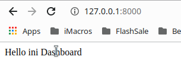
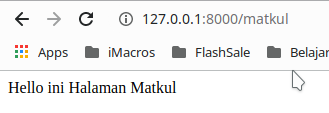

Router adalah gerbang untuk mengakses aplikasi laravel. Router digunakan untuk mengarahkan request untuk mendapatkan response yang kita inginkan. Request dikirimkan melalui HTTP dan diakses menggunakan URL. Pada URL lah kegunaan router dapat terlihat oleh user :v. Karena beda URL beda pula response.

Karena Router memanfaatkan HTTP untuk transfer data, terlebih dahulu yang perlu diketahui adalah HTTP Method. HTTP Method yang wajib diketahui untuk CRUD antara lain :

1. GET  (Mengambil data dari server)
2. POST (Menambahkan data ke server)
3. PATCH or PUT (Update data)
4. DELETE (Menghapus data)

## Menggunakan Router

Router pada laravel terdapat pada file ./routes/web.php. Disanalah kita akan mendaftarkan semua router yang diperlukan. Edit router menjadi seperti dibawah :

```php
// Route merupakan class yang digunakan untuk mendaftarkan router kita
// ::get merupakan HTTP Method GET. Ada juga ::post, ::put, ::delete
// /, /matkul, /mahasiswa merupakan Path yang akan diakses lewat URL
Route::get('/', function () {
    return "Hello ini Dashboard";
});

Route::get('/matkul', function() {
    return "Hello ini Halaman Matkul";
});

Route::get('/jadwal', function() {
    return "Hello ini Halaman Jadwal";
});
```

Jadinya akan seperti dibawah :





Untuk mengaksesnya jalankan `php artisan serve`

<br> <br> <hr>

<p align="center">
    <a href="./04%20-%20Make%20Migrations.md"> <- Prev </a>| <a href="./06%20-%20Controller.md"> Next -> </a>
</p>