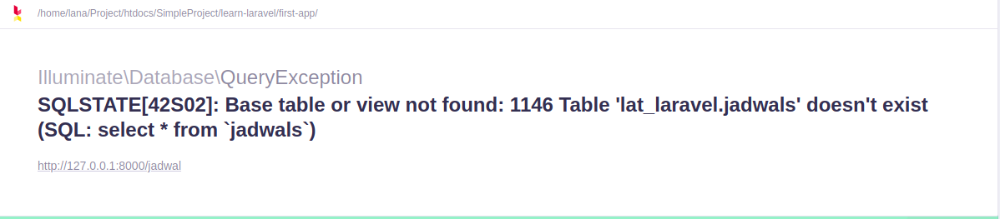

Model adalah penghubung antara Controller dengan Database. Model akan berperan untuk menyimpan, mengubah, menghapus dan mengambil data dari Database.

# Membuat Model

Untuk membuat model kita bisa menulis secara manual atau menggenerate melalui Artisan CLI. Perintah untuk menggenerate model :

`php artisan make:model Jadwal`

Hasil dari generate code :

```php
namespace App\Models;

use Illuminate\Database\Eloquent\Factories\HasFactory;
use Illuminate\Database\Eloquent\Model;

class Jadwal extends Model
{
    use HasFactory;
}
```

Dilihat dari hasil generate, class Mahasiswa extend kepada class Model. class Model sendiri merupakan bagian dari library *Eloquent*. *Eloquent* merupakan library yang memudahkan kita untuk mengelola data pada laravel. Dengan *Eloquent* kita sudah tak perlu menuliskan kode SQL untuk mengolah data. Karena *Eloquent* lah yang akan menangani semuanya.

Tentang Eloquent akan kita bahas di modul berikutnya :)

# Menghubungkan models dengan controller

1. Masuk ke `./app/Http/Controllers/JadwalController.php`
2. Panggil Model kedalam Controller
   
   `use App\Models\Jadwal;` (Pastekan diatas class)

3. Ubah fungsi index() pada class JadwalController menjadi seperti dibawah.
   ```php
        public function index()
        {
            // Mengambil semua data dari database
            $jadwal = Jadwal::all();
            return $jadwal;
        }
   ```
4. Sekarang coba. Pasti hasilnya seperti dibawah. Yang mengatakan bahwa table jadwals tidak ada.
   
   

   Secara default ketika kita memanggil Models pada Controller, Laravel akan menambahkan huruf `s` setelah nama class sebagai nama table yang akan dipanggil.

   Untuk mengatasi error diatas kita perlu mengesets nama table terlebih dahulu di class Models.

5. Masuk ke `./app/Http/Models/Jadwal`. Tambahkan kode dibawah ini keadalam class untuk mengeset nama table yang ingin dipanggil.
   
   `protected $table = 'jadwal';`


## Memaksimalkan Eloquent

Seperti yang sudah dijelaskan diatas. 