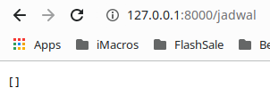

Model adalah penghubung antara Controller dengan Database. Model akan berperan untuk menyimpan, mengubah, menghapus dan mengambil data dari Database.

# Membuat Model

Untuk membuat model kita bisa menulis secara manual atau menggenerate melalui Artisan CLI. Perintah untuk menggenerate model :

`php artisan make:model Jadwal`

Hasil dari generate code :

```php
namespace App\Models;

use Illuminate\Database\Eloquent\Factories\HasFactory;
use Illuminate\Database\Eloquent\Model;

class Jadwal extends Model
{
    use HasFactory;
}
```

Dilihat dari hasil generate, class Mahasiswa extend kepada class Model. class Model sendiri merupakan bagian dari library *Eloquent*. *Eloquent* merupakan library yang memudahkan kita untuk mengelola data pada laravel. Dengan *Eloquent* kita sudah tak perlu menuliskan kode SQL untuk mengolah data. Karena *Eloquent* lah yang akan menangani semuanya.

Tentang Eloquent akan kita bahas di modul berikutnya :)

# Menghubungkan models dengan controller

1. Masuk ke `./app/Http/Controllers/JadwalController.php`
2. Panggil Model kedalam Controller
   
   `use App\Models\Jadwal;` (Pastekan diatas class)

3. Ubah fungsi index() pada class JadwalController menjadi seperti dibawah.
   ```php
        public function index()
        {
            // Mengambil semua data dari database
            $jadwal = Jadwal::all();
            return $jadwal;
        }
   ```
4. Sekarang coba. Pasti hasilnya seperti dibawah. Yang mengatakan bahwa table jadwals tidak ada.
   
   

   Secara default ketika kita memanggil Models pada Controller, Laravel akan menambahkan huruf `s` setelah nama class sebagai nama table yang akan dipanggil.

   Untuk mengatasi error diatas kita perlu mengesets nama table terlebih dahulu di class Models.

5. Masuk ke `./app/Http/Models/Jadwal`. Tambahkan kode dibawah ini keadalam class untuk mengeset nama table yang ingin dipanggil.
   
   `protected $table = 'jadwal';`

6. Sekarang coba refresh browser
   
   

7. Yeyyy, sudah bisa :v 


# Membuat Simple CRUD 

## Get All Data

Edit function index() pada JadwalController

```php
   public function index()
   {
      // Mengambil semua data jadwal dari database
      // Kegunaan all() sama dengan 'SELECT * FROM jadwal'
      $jadwal = Jadwal::all();
      // Fungsi mengembalikan nilai berupa data jadwal
      return $jadwal;
   }
```

Buka *localhost:8000/jadwal* untuk melihat hasilnya.


Seperti yang kalian lihat, masih Kosong :v. Karena belom ada data didalamnya. Untuk menginputkan akan dibahas dibawah.

## Input Data

```php
   public function store(Request $request)
   {
      // $request merupakan parameter yang berisi informasi 
      // mengenai request tersebut. Seperti header, body
      // query parameter dll. Parameter tersebut sudah
      // otomatis ditangani oleh laravel.
      $jadwal = new Jadwal();
      // Set column name dengan nilai dari $request->name
      $jadwal->name = $request->name;
      $jadwal->day = $request->day;
      $jadwal->matkul = $request->matkul;
      $jadwal->class = $jadwal->class;
      // Menyimpan data ke database
      $jadwal->save();

      return $jadwal;
   }
```
Masuk ke `./routes/web.php`, tambahkan :

`Route::post('/jadwal/add', [JadwalController::class, 'show']);`

Hasilnya belum bisa dilihat. Karena kita memerlukan form untuk mencobanya

## Get Data by Id

```php
   public function show($id)
   {
      // Fungnsi find merupakan fungsi default dari class Model
      // Jadi kita tak perlu menulis ulang fungsi pada class
      // turunannya
      // Gunanya untuk mencari data berdasarkan inputan user
      $jadwal = Jadwal::find($id);
      return $jadwal
   }
```

Masuk ke `./routes/web.php`, tambahkan :

`Route::get('/jadwal/{id}', [JadwalController::class, 'show']);`

## Update Data

```php
   public function update(Request $request, $id)
   {
      // Cari data terlebih dahulu
      $jadwal = Jadwal::find($id);
      // Memperbarui nilai
      $jadwal->name = $request->name;
      $jadwal->day = $request->day;
      $jadwal->matkul = $request->matkul;
      $jadwal->class = $jadwal->class;
      // Mengupdate data ke database
      $jadwal->update();

      return $jadwal;  
    }
```

## Delete Data

```php
   public function destroy($id)
    {
        //
        $jadwal = Jadwal::find($id);
        $jadwal->delete();
        
        return "sukses menghapus ".$id;
    }
```

<br> <br> <hr>

<p align="center">
    <a href="./06%20-%20Controller.md"> <- Prev </a>| <a href="./08%20-%20Views.md"> Next -> </a>
</p>